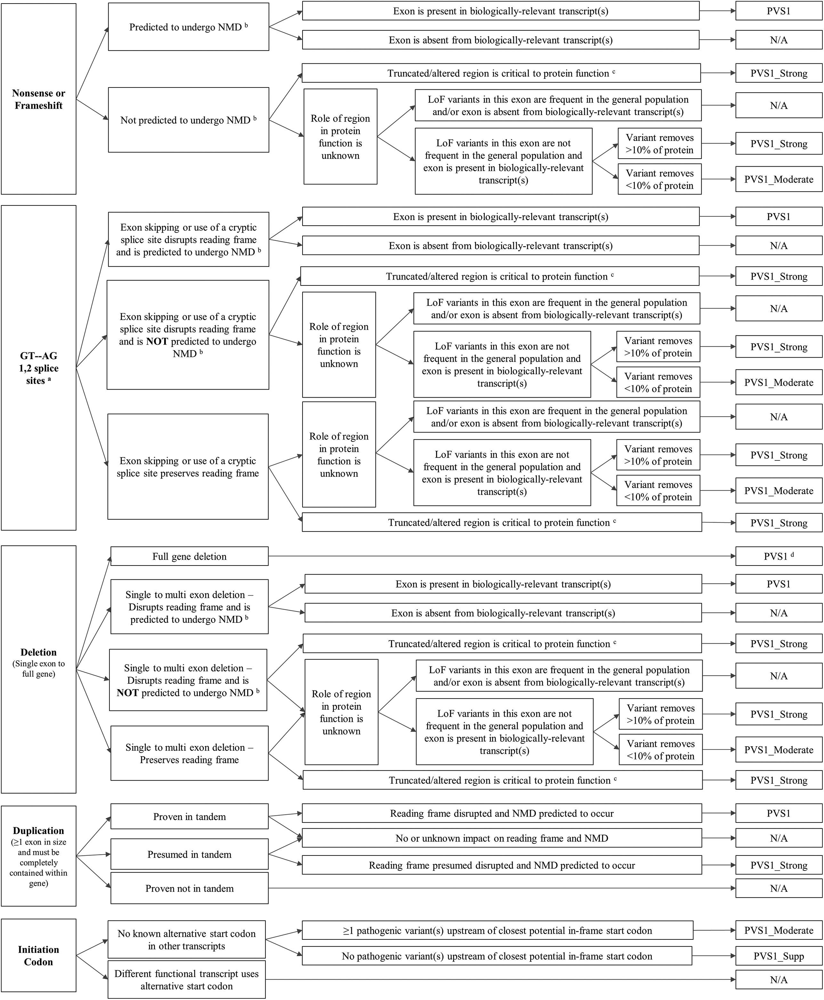

.. _acmg_pvs1_algorithm:

==============
PVS1 Algorithm
==============

The core of the auto-acmg service is its Algorithm.
The Algorithm is based on the paper `Recommendations for interpreting the loss of function PVS1 ACMG/AMP variant criterion <https://www.ncbi.nlm.nih.gov/pmc/articles/PMC6185798/>`__,
and basically implements the provided guidelines.

Here you'll find information about the Algorithm's main components and how they work together.

--------
Overview
--------

The central approach is following the provided guidelines to determine if a variant is pathogenic based on the PVS1 
criterion.

    Algorithm Overview

The internal implementation isolates the different blocks from each other and combines them in a "predict" function.

